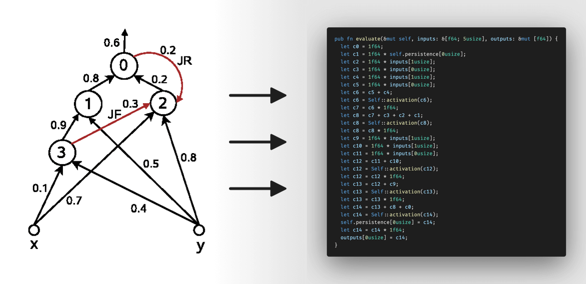

# `const_cge`: Neural Network Compiler

## Disclaimer: crate slightly broken for now



# What do?

`const_cge` performs a symbolic evaluation of your neural network at compile time, producing efficient rust code with identical behavior.

With the information about data dependencies inside the network available, 
LLVM is able to perform more advanced optimizations, like instruction ellision, 
pipeline-aware reordering, SIMD vectorization, register + stack size minimization, and more.

The generated rust code: 
- will never allocate, panic, or rely on `std` constructs
- has input and output dimensions which are statically declared
- has internal data dependencies that are statically analyzable
- utilizes an exactly minimal recurrent state array, or none at all (only pay for what you use)
- statically captures properties of your neural network in the type system
- incurs zero overhead cost at runtime

Check out [`eant2`](todo) to see how to train a neural network compatible with `const_cge`.

# Simple Example

## Network
The `network` macro generates all of the fields and functions required to evaluate our network.

```rust
/// Use sensor data to control the limbs of a robot (using f32 only).
#[network("nets/walk.cge", numeric_type = f32)]
struct Walk;

let mut walk = Walk::default();

// I/O is statically sized to match our network
walk.evaluate(&input, &mut output);
```

# Compile Time Guarantees
## Nonrecurrent
It is sometimes a problem if a network can squirel away information about its past states (recurrency).

You can use `nonrecurrent`, which will halt compilation if the imported network contains any recurrency:

```rust
/// Predict which lighting color would best complement the current sunlight color
#[nonrecurrent("nets/color.cge")]
struct Color;

// evaluate is now a static function.
// it has no state, and this is captured in the type system.
Color::evaluate(&input, &mut output);
```

## Recurrent
Some tasks are best solved using recurrent architectures, and the inclusion of a non-recurrent network would be a mistake.

You can use `recurrent`, which will halt compilation if the imported network contains no recurrency:

```rust
/// Detect if our device has just been dropped and is currently falling through the air
#[recurrent("nets/drop.cge")]
struct Dropped;

let mut d = Dropped::default();
d.evaluate(&input, &mut output);
```

# Recurrent State?

Recurrent state stores the previous value of a neuron for use in the next evaluation (sent backwards in the network).

The state inside a recurrent network is represented as either `[f64; N]` or `[f32; N]`, and is updated on every evaluation. As mentioned before, it is made only as large as it needs to be.

If you like, you can read this state, modify it, restore it later, etc.

```rust
/// Attempt to clarify audio stream
#[recurrent("nets/denoise.cge")]
struct Denoise;

// initially-zero recurrent state
let mut a = Denoise::default();

// some evaluations later, read internal state, send it to a server, etc.
let state = d.recurrent_state();
```

Review [the documentation](https://docs.rs/const_cge) for additional methods relating to recurrent state.

# `numeric_type`

- You often don't need the precision of `f64`, and `f64` is in general larger and slower than `f32`. `f64` will behave __identically__ to your CGE file, and so it is the default behavior.
- You can perform (lossy) parameter 'downcasting' on your network, causing all parameters and operations to use your requested type: 

```rust
#[network("net.cge", numeric_type = f32)
struct SmallerFaster;
```

- Only `f64` and `f32` are supported for now. Maybe I will add support for integer / fixed-precision in the future.

# Design Goals & Drawbacks

- You can accomplish quite a lot with "small" networks, especially for control tasks. `const_cge` is not intended for use in "deep learning" tasks (language modeling, etc).
- Tradeoffs that favor embedded use cases (robotics, $0.05 USD microcontrollers)
- Lots of individual `const_cge` networks in the same binary may end up being _larger_ or _slower_ than a runtime evaluation approach.
This will depend on the target machine and the networks you're evaluating. If you really care, measure. This library should cover the common use case perfectly.

# [`MIT License`](https://opensource.org/licenses/MIT)


```text
Copyright © 2022 Will Brickner

Permission is hereby granted, free of charge, to any person obtaining a 
copy of this software and associated documentation files (the "Software"), 
to deal in the Software without restriction, including without limitation 
the rights to use, copy, modify, merge, publish, distribute, sublicense, 
and/or sell copies of the Software, and to permit persons to whom the 
Software is furnished to do so, subject to the following conditions:

The above copyright notice and this permission notice shall be included in 
all copies or substantial portions of the Software.

THE SOFTWARE IS PROVIDED "AS IS", WITHOUT WARRANTY OF ANY KIND, EXPRESS 
OR IMPLIED, INCLUDING BUT NOT LIMITED TO THE WARRANTIES OF MERCHANTABILITY, 
FITNESS FOR A PARTICULAR PURPOSE AND NONINFRINGEMENT. IN NO EVENT SHALL THE 
AUTHORS OR COPYRIGHT HOLDERS BE LIABLE FOR ANY CLAIM, DAMAGES OR OTHER 
LIABILITY, WHETHER IN AN ACTION OF CONTRACT, TORT OR OTHERWISE, ARISING 
FROM, OUT OF OR IN CONNECTION WITH THE SOFTWARE OR THE USE OR OTHER 
DEALINGS IN THE SOFTWARE.
```